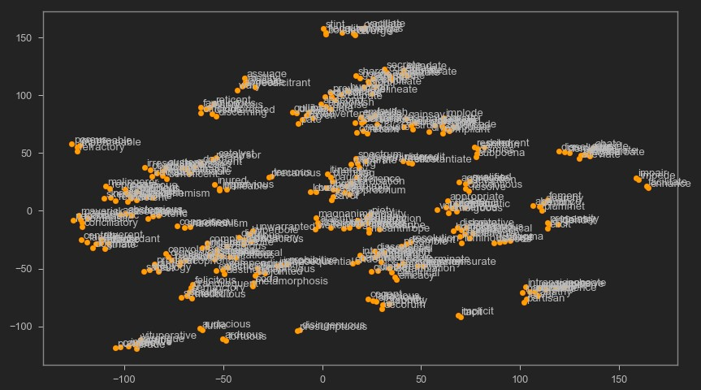

# barrons-clustering
Experimental repo created for clustering Barron's GRE 333 &amp; 1000 words list. Used personally to help visualize synonymous words from the list. Results of clustering in [res](res) folder. From the PCA and t-SNE viz, there are "dense" regions split by areas of low density in small clusters as well as one or two big blobs - there's too much noise spurted out by dbscan. Lemmatizing before clustering might help little more.

